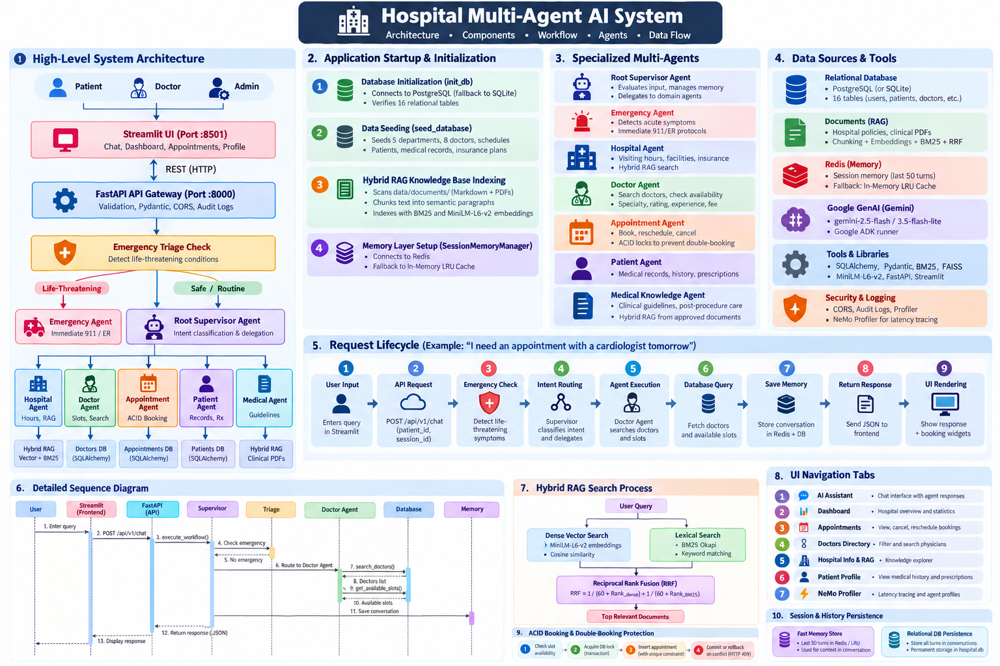

# Hospital Multi-Agent AI System (Google ADK Edition)

A scalable, production-grade healthcare assistant built using **Google ADK multi-agent architecture**, **FastAPI**, **PostgreSQL** (with local SQLite auto-fallback), **SQLAlchemy**, and **Streamlit**.

---

## 🏛️ System Architecture & Workflow

<p align="center">
  
</p>

### 🔄 Architecture Overview

```
                                  USER
                                   │
                                   ▼
                         Streamlit UI (:8501)
     (Dashboard, Multi-Agent AI Chat, Appointments, Patient Hub)
                                   │
                                   ▼
                      FastAPI Gateway (:8000)
             (Validation, Audit Logging, REST Endpoints)
                                   │
                                   ▼
                   Google ADK Root / Supervisor Agent
         (Intent Detection, Routing, Sub-Agent Coordination)
                                   │
         ┌───────────────┬─────────┴───────┬──────────────┬──────────────┐
         ▼               ▼                 ▼              ▼              ▼
   Hospital Agent  Patient Agent     Doctor Agent   Appointment    Emergency Agent
  (Timings, RAG)  (Profile, Rx)    (Specialties,     Agent (ACID     (Life-Threat
                                    Schedules)       Booking Locks)    Triage)
         │               │                 │              │              │
         ▼               ▼                 ▼              ▼              ▼
     RAG Hybrid      PostgreSQL        PostgreSQL      PostgreSQL      Safety
    Vector+BM25      Services          Services         Locks &        Escalation
    (pgvector)                                        Transactions     (911/ER)
```

---

## 🛠️ Technology Stack

The system is built on a modern, decoupled healthcare AI architecture with the following technology stack:

### 1. Frontend & User Interface
- **[Streamlit](https://streamlit.io/) (`>=1.38.0`)**: High-performance interactive UI framework hosting the patient dashboard, real-time doctor slot picker, appointment management, and conversational multi-agent chat interface.
- **Custom Theming & Vanilla CSS3**: Custom soothing healthcare light-green theme tokens (`#f0fdf4`, `#059669`, `#e6f4ea`), Google Font typography (*Inter*), responsive glassmorphic cards, emergency alert banners, and reactive agent identity badges.
- **Requests & HTTPX**: Synchronous and asynchronous HTTP clients handling REST communication with the backend API gateway.

### 2. Backend & API Gateway
- **[FastAPI](https://fastapi.tiangolo.com/) (`>=0.115.0`)**: High-performance asynchronous web framework providing REST endpoints, audit logging, CORS middleware, and automated OpenAPI/Swagger documentation at `/docs`.
- **[Uvicorn](https://www.uvicorn.org/) (`>=0.30.0`)**: Production-grade ASGI web server running FastAPI services.
- **[Pydantic v2](https://docs.pydantic.dev/) (`>=2.8.0`) & `pydantic-settings` (`>=2.4.0`)**: Strict schema validation, DTO models, request serialization, and environment configuration management (`.env`).

### 3. Multi-Agent AI & Orchestration
- **Google ADK Multi-Agent Pattern**: Hierarchical Supervisor / Sub-Agent routing pattern coordinating 7 specialized clinical and operational agents:
  - *Root Supervisor Agent* (intent routing, conversational memory synthesis)
  - *Hospital Agent* (hours, departments, facilities, insurance policies)
  - *Doctor Agent* (specialties, profiles, consulting fees, scheduling)
  - *Appointment Agent* (ACID-safe booking, rescheduling, cancellation)
  - *Patient Agent* (confidential patient records, profile details, appointments)
  - *Medical Knowledge Agent* (approved patient education & post-care instructions)
  - *Emergency Agent* (zero-latency heuristic & semantic emergency triage)
- **[Google GenAI SDK](https://github.com/googleapis/python-genai) (`google-genai >= 1.0.0`)**: Integration with Google Gemini (`gemini-2.5-flash`) for multi-agent reasoning, augmented with an automatic deterministic offline reasoning fallback.

### 4. Retrieval-Augmented Generation (RAG)
- **Hybrid Search Pipeline**:
  - **Dense Vector Search**: Semantic similarity matching across clinical guideline and hospital document embeddings.
  - **Lexical Keyword Search**: **Rank-BM25** (`rank-bm25 >= 0.2.2`) Okapi BM25 ranking algorithm.
  - **Reciprocal Rank Fusion (RRF)**: Merges vector distance and lexical scores to maximize retrieval precision.
- **Curated Hospital Knowledge Base**: Markdown clinical guides, visitor policies, and department FAQs (`data/documents/`).

### 5. Database, ORM & Concurrency Controls
- **[SQLAlchemy 2.0](https://www.sqlalchemy.org/) (`>=2.0.30`)**: Modern Python Object Relational Mapper (ORM) powering a 16-table relational schema with ACID transaction isolation.
- **PostgreSQL / pgvector (`psycopg2-binary >= 2.9.9`)**: Production-grade relational database with vector extension for embeddings.
- **SQLite (Auto-Fallback)**: Built-in local fallback database enabling instantaneous zero-dependency local development and CI testing.
- **ACID Concurrency Locking**: Database unique constraint `uix_doctor_datetime_slot` preventing double-booking race conditions during high-concurrency booking spikes.

### 6. Session State, Memory & Caching
- **[Redis](https://redis.io/) (`redis >= 5.0.0`)**: Distributed caching and session memory manager storing conversation turns (`session:{session_id}:messages`) and distributed locks.
- **In-Memory LRU Cache Fallback**: Seamless local in-process fallback ensuring memory features work even without an active Redis instance.

### 7. Testing, Containerization & Utilities
- **[pytest](https://docs.pytest.org/) (`>=8.0.0`)**: Automated test suite with 42 unit and integration tests covering concurrency locks, emergency triage, RAG PDF ingestion, NeMo profiles, agent routing, and REST endpoints.
- **Docker & Docker Compose**: Multi-container containerization with `Dockerfile.backend`, `Dockerfile.frontend`, and `docker-compose.yml`.
- **python-dateutil (`>=2.9.0`)**: Robust datetime manipulation for doctor shifts, leave calculations, and slot generation.

---

## 🤖 Google ADK Multi-Agent Design

The system employs a hierarchical supervisor multi-agent architecture:

| Agent | Responsibility | Core Tools & Data |
|---|---|---|
| **Root Supervisor** | Intent classification, sub-agent routing, conversation memory | Specialized sub-agents, session context |
| **Hospital Agent** | Hospital visiting hours, departments, facilities, accepted insurances | RAG hybrid search (`search_hospital_knowledge`), `get_department`, `get_hospital_service` |
| **Patient Agent** | Patient profile, active prescriptions, medical history | `get_current_patient`, `get_patient_appointments`, `get_patient_prescriptions`, `get_patient_records` |
| **Doctor Agent** | Specialty matching, doctor bio/experience, consultation fees, schedules | `search_doctors`, `get_doctor_details`, `get_available_slots` |
| **Appointment Agent** | Transaction-safe booking, slot conflict resolution, cancellation, reschedule | `book_appointment` (ACID lock), `cancel_appointment`, `reschedule_appointment` |
| **Medical Knowledge Agent** | Approved patient education (hypertension, post-op wound care, diabetes) | Approved clinical guidelines RAG |
| **Emergency Agent** | Immediate zero-latency triage for life-threatening symptoms (chest pain, stroke, severe trauma) | Triage rule engine, emergency escalation protocol |

---

## 📊 Project Status & Task Breakdown

### 🟢 Completed Tasks

- [x] **Phase 1 — Foundation & Database Layer**:
  - Full relational schema (16 models) implemented via SQLAlchemy (`users`, `roles`, `patients`, `doctors`, `departments`, `doctor_specializations`, `doctor_schedules`, `doctor_leaves`, `appointments`, `medical_records`, `prescriptions`, `hospital_services`, `insurance_providers`, `notifications`, `conversations`, `memory_records`, `audit_logs`).
  - Database engine with automatic PostgreSQL / SQLite fallback for instant local dev without external database dependencies.
  - Complete seed data pipeline (`seed.py`) with realistic doctors, departments, schedules, patient records, and hospital amenities.
  - FastAPI application entrypoint with CORS, healthchecks, and structured error handlers.
- [x] **Phase 2 — Hospital RAG Pipeline**:
  - Semantic markdown knowledge base created for hospital hours, visitor policies, insurance coverage, and clinical guidelines (`data/documents/`).
  - Hybrid retrieval combining **Dense Vector Embeddings** and **BM25 Okapi** lexical search with **Reciprocal Rank Fusion (RRF)**.
  - Hospital Agent RAG tools: `search_hospital_knowledge`, `get_department`, `get_hospital_service`, `get_accepted_insurances`.
- [x] **Phase 4 — Doctor Agent & Discovery**:
  - Search by physician name, specialty (Cardiology, Neurology, Pediatrics, Orthopedics, General Medicine), or department.
  - Real-time consultation slot calculation filtering out doctor leaves, off-hours, and active bookings.
- [x] **Phase 5 — Transaction-Safe Appointment Management**:
  - Concurrency control preventing double-booking race conditions using database unique constraints (`uix_doctor_datetime_slot`) and transaction isolation.
  - Booking, cancellation, and rescheduling with state verification and patient ownership checks.
- [x] **Phase 6 — Google ADK Multi-Agent Orchestration**:
  - Root Supervisor agent routing user queries to specialized sub-agents based on intent classification.
  - Dual-mode reasoning: Google Gemini LLM synthesis when `GEMINI_API_KEY` is present, with an offline deterministic fallback for immediate testability.
- [x] **Phase 7 — Short-Term State & Memory**:
  - Hybrid memory management via `SessionMemoryManager`: active Redis cache for production (`session:{session_id}:messages`) with seamless in-memory LRU fallback for zero-dependency local development.
  - Conversational sliding context window formatting recent turns (`format_chat_history`) injected into LLM/sub-agent prompts for multi-turn dialogue resolution.
  - Distributed and local concurrency lock management (`acquire_lock` / `release_lock`).
  - Chat history endpoints (`GET /api/v1/chat/history/{session_id}`, `DELETE /api/v1/chat/history/{session_id}`, `GET /api/v1/chat/status`).
  - Frontend UI integration with live memory engine badge and "Clear Chat" control.
- [x] **Phase 9 — Safety & Emergency Triage**:
  - Zero-latency heuristic & semantic emergency detector for acute clinical symptoms (chest pain, stroke signs, severe hemorrhage, choking).
  - Immediate Level 1 Trauma escalation bypassing appointment flows with 911/ER guidance and direct emergency line (`(555) 0911`).
  - Security audit logging recording patient data reads, bookings, and cancellations.
- [x] **Phase 10 — Frontend & Test Automation**:
  - Streamlit UI with modern healthcare styling, active patient switcher, interactive AI chat with agent badges, appointments calendar, doctor directory, and patient medical profile viewer.
  - 42 automated unit and integration tests covering concurrency locks, RAG search and PDF ingestion, emergency escalation, session memory, NeMo profiles, and API routes.

---

### 🟡 Partially Completed Tasks

- [ ] **Phase 3 — Patient Authentication & RBAC**:
  - *Current Status*: Active patient context switcher is fully implemented in the UI and API (allowing seamless switching between simulated profiles like John Doe, Sarah Connor, Alice Johnson without requiring login or signup, per project design).
  - *Remaining for Production*: Enforcing strict JWT access/refresh token verification, password hashing (bcrypt), and role-based login guards when authentication is formally re-enabled.
- [ ] **Phase 8 — Notifications & Asynchronous Workers**:
  - *Current Status*: Notification service dispatches appointment confirmation and cancellation notices, logs them into the `notifications` database table, and streams to worker logs.
  - *Remaining for Production*: Live SMTP/SendGrid email delivery and Twilio SMS gateway integration via Celery/Redis background queues.
- [ ] **Phase 10 — Docker & Containerization**:
  - *Current Status*: Multi-service `docker-compose.yml`, `Dockerfile.backend`, and `Dockerfile.frontend` are defined and ready.
  - *Remaining for Production*: Multi-stage container optimization and Kubernetes deployment manifests (Helm charts).

---

### 🔴 Pending / Future Roadmap Tasks

- [ ] **Production Observability & Metrics**:
  - Prometheus metrics exporter for API request latency, agent routing distribution, and database query timings.
  - Grafana dashboard template for real-time appointment booking volume and error rate monitoring.
  - OpenTelemetry / LangSmith agent tracing for LLM token usage and latency profiling.
- [ ] **Advanced RAG Capabilities**:
  - PDF parser integration for automated physician clinical note ingestion.
  - Dedicated cross-encoder reranker model (e.g. `bge-reranker-large`) for second-stage candidate re-ranking.
  - Milvus / Qdrant vector database integration for enterprise-scale document collections exceeding 100,000 pages.
- [ ] **CI/CD & DevOps Pipeline**:
  - GitHub Actions workflow for automated linting (`flake8`, `black`), type-checking (`mypy`), and test execution on pull requests.
  - Nginx reverse proxy configuration with SSL/TLS termination and rate limiting.

---

## 🔒 Concurrency & Transactional Safety

Appointment booking protects against double-booking race conditions through:
1. **Database Unique Constraints**: `uix_doctor_datetime_slot` on `(doctor_id, appointment_date, appointment_time)`.
2. **Transaction Isolation**: Verification and atomic commit inside database transaction.
3. **Audit Logging**: Every sensitive patient read, booking, and cancellation is logged into the `audit_logs` table.

---

## 🚀 Quickstart

### 1. Clone & Install Dependencies
```bash
git clone <repo-url>
cd Hospital-Multi-agent

pip install -r requirements.txt
```

### 2. Configure Environment (Optional)
Copy `.env.example` to `.env`:
```bash
cp .env.example .env
```
*(If `GEMINI_API_KEY` is provided, the system utilizes Google Gemini for LLM synthesis; if omitted, the deterministic offline reasoning engine seamlessly activates).*

### 3. Run FastAPI Backend
```bash
python -m uvicorn backend.app.main:app --host 0.0.0.0 --port 8000 --reload
```
Interactive Swagger docs will be available at: [http://localhost:8000/docs](http://localhost:8000/docs).

### 4. Run Streamlit UI
In a separate terminal:
```bash
streamlit run frontend/streamlit_app.py
```
Open [http://localhost:8501](http://localhost:8501) in your browser.

---

## 🧪 Running the Test Suite

Run the comprehensive pytest suite covering concurrency race conditions, emergency triage, RAG retrieval, and agent routing:

```bash
python -m pytest -v tests/
```

---

## 🐳 Docker Deployment

To launch the full containerized stack (PostgreSQL + pgvector, Redis, FastAPI, Streamlit):
```bash
docker compose up --build
```
